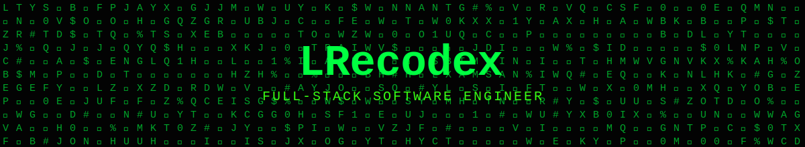
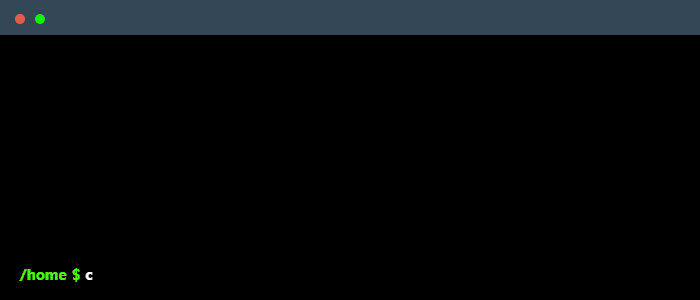

<!--
    root@LRecodex:~$
    Thanks for cd-ing into my profile. Feel free to fork any snippet you like from here.
-->

 

  

 

 

 

 

<!--
    That's a wrap. Star the repo if this theme inspired yours!
-->
