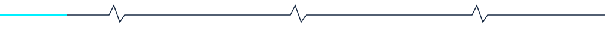

<!--
    ┌──────────────────────────────────────────────┐
    │  root@LRecodex:~$ ./boot.sh                  │
    │  welcome to LRX-OS — enjoy the boot sequence │
    └──────────────────────────────────────────────┘
-->

### `$ ./boot.sh --load-modules`

&nbsp;<code>$ ls --icons ./stack</code> — expand icon grid

 

 

 

### `$ ./diagnostics.sh --verbose`

<table>
<tr>
<td width="50%">

</td>
<td width="50%">

</td>
</tr>
</table>

  

### `$ top -p $(pgrep snake)`

 

<!--
    > shutdown -h now
    That's the whole OS. Fork the theme, remix it, make it yours.
-->
